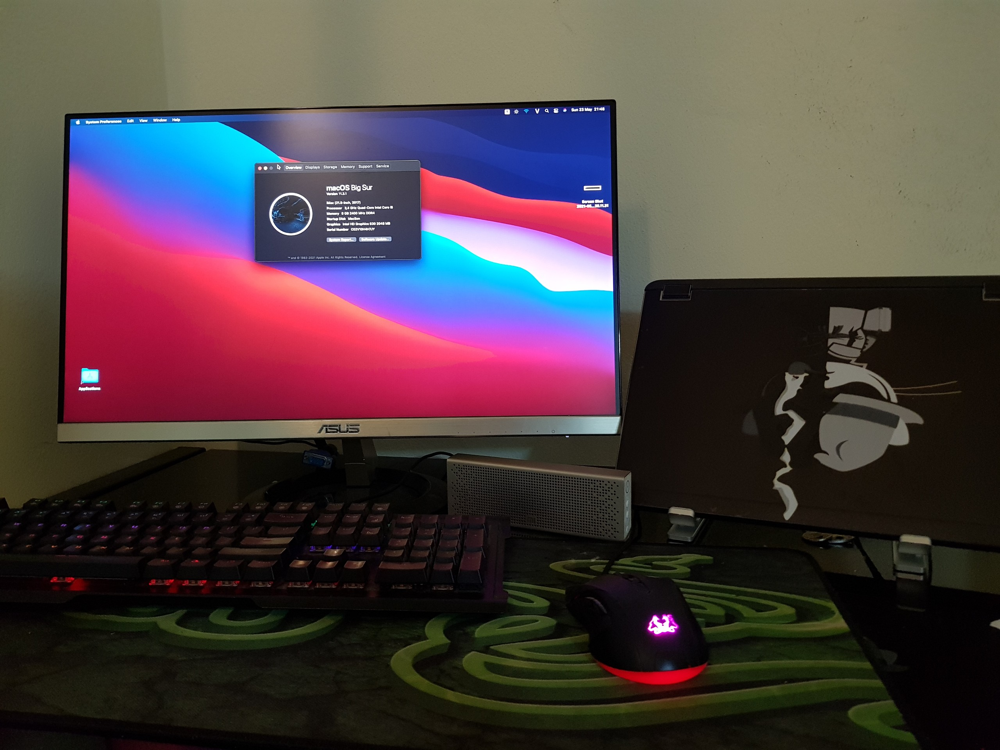

# Bigsur On ASUS PRIME B250M-A

# Specs:
- SSD: Apacer Armor AS681 SATA III 
- CPU: Intel Core i5-7500 @ 3.40GHz	
- Display: Asus 23.8"VZ249H LED RGB
- GPU: Intel Integrated HD Graphics 630
- Ethernet: Realtek RTL8111H
- Audio Adapter: Realtek ALC256 

# Working:
- Intel HD Graphics 630
- Restart and Shutdown
- CPU Power Management
- Ethenet 
- Audio (Realtek ALC 887)
- HDMI Port
- All USB Ports

# Image:

